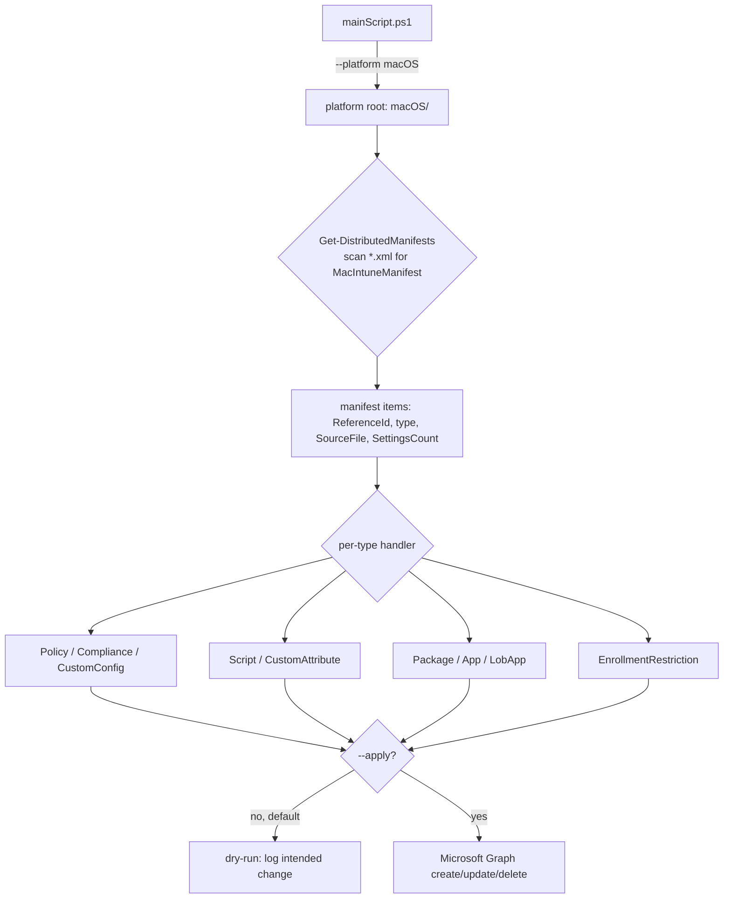

<!-- Copyright (c) Microsoft Corporation. -->
<!-- Licensed under the MIT License. -->

# Architecture

How `intune-my-macs` is put together, so an agent or contributor can reason about
a change without reading the whole engine. See [../AGENTS.md](../AGENTS.md) for
the entry point and [conventions.md](conventions.md) for day-to-day rules.

> **Scope:** this is a **proof-of-concept** deployment toolkit, not a hardened
> product. It reads a tree of declarative artifacts and reflects them into a
> Microsoft Intune tenant via Microsoft Graph.

## Components

| Component | Role |
| --- | --- |
| `mainScript.ps1` | The deployment engine (PowerShell 7+). Resolves the platform, discovers artifact manifests, connects to Microsoft Graph, and creates/updates/deletes Intune objects. |
| `Start-IntuneMyMacs.ps1` | macOS-only SwiftDialog GUI that gathers options (prefix, tenant, assignment group, MDE, dry-run vs apply, manifest selection) and shells out to `mainScript.ps1`. |
| `macOS/` (per-platform folder) | The declarative artifact trees: `configurations/`, `apps/`, `custom attributes/`, `scripts/`, `mde/`, `resources/`. |
| `standards/` | The naming and manifest standards every artifact must follow. |
| `tools/` | Developer tooling — documentation generation, policy export, duplicate-setting detection, assignment reporting, fork-sync. |
| `scripts/` | The PowerShell validation loop — `verify.ps1` (well-formedness) and `check-context.ps1` (agent-context golden guard). |

## Platform model

`mainScript.ps1` targets one **platform folder** per run, selected with
`--platform` (default `macOS`; `Windows`, `iOS`, and `Android` are recognized
values for future trees). The selected platform's root (e.g. `macOS/`) becomes
the scan scope — only artifacts under that folder are considered for the run.
This keeps the engine platform-agnostic while the artifact content stays
organized per OS.

## The manifest model (the core invariant)

Every deployable artifact (`.json` Settings Catalog policy, `.mobileconfig`
custom configuration, device/custom-attribute script, or `.pkg`) is paired with
a **sibling `.xml` manifest** whose root is `<MacIntuneManifest>`.

Key points:

- **Discovery is manifest-driven.** `Get-DistributedManifests -BasePath
  <platformRoot>` recursively finds `*.xml` files containing a
  `<MacIntuneManifest>` element. **A file without a manifest is never
  deployed** — that is how helper files (`tools/`, `scripts/`, docs) stay
  out of tenant deployments.
- **Each manifest declares** a unique `<ReferenceId>` (`TYPE-CATEGORY-NUMBER`),
  a `<SourceFile>` that must resolve to a real file, and a `<SettingsCount>`.
- **Artifact types** the engine handles: `Policy`, `Compliance`, `CustomConfig`,
  `Script`, `CustomAttribute`, `Package`, `App`, `LobApp`, and
  `EnrollmentRestriction`.

## Execution flow

1. **Parse arguments** — platform, scope flags (`--apps`, `--config`,
   `--compliance`, `--scripts`, `--custom-attributes`, `--enrollment`), `--mde`,
   `--prefix`, `--assign-group`, `--tenant-id`, `--names`, `--remove-all`,
   `--apply`.
2. **Connect to Microsoft Graph** using the Microsoft Graph PowerShell SDK
   (auto-installed from the public PowerShell Gallery on first run).
3. **Discover manifests** under the selected platform root.
4. **Resolve placeholders** — e.g. `REPLACE_WITH_TENANT_ID` is substituted with
   the connected (or `--tenant-id`) tenant at deploy time; Intune-native tokens
   such as `{{mail}}` are left untouched.
5. **Reconcile per type** — for each artifact, create or update the Intune
   object, naming it `[Prefix] [ReferenceId] - [Name]` for idempotency; optional
   assignment to an Entra group via `--assign-group`.
6. **Dry-run by default** — nothing is written unless `--apply` is passed.
   `--remove-all` deletes previously created objects that match the current
   prefix.

## Invariants an agent must preserve

- A deployable artifact **must** have a sibling `.xml` manifest with a **unique**
  `<ReferenceId>` and a `<SourceFile>` that resolves.
- Settings Catalog `settings[]` IDs are **contiguous and 0-based**.
- The naming prefix is the idempotency key — changing it creates parallel objects
  rather than updating existing ones.
- Sensitive, tenant-specific files (the MDE onboarding payload) are **never**
  committed; they are supplied locally and gitignored.

## Related

- [conventions.md](conventions.md) — naming, manifest, and header rules.
- [testing-patterns.md](testing-patterns.md) — how changes are validated.
- [../standards/policy-naming-standard.prd](../standards/policy-naming-standard.prd)
  · [../standards/manifest-standard.prd](../standards/manifest-standard.prd).
